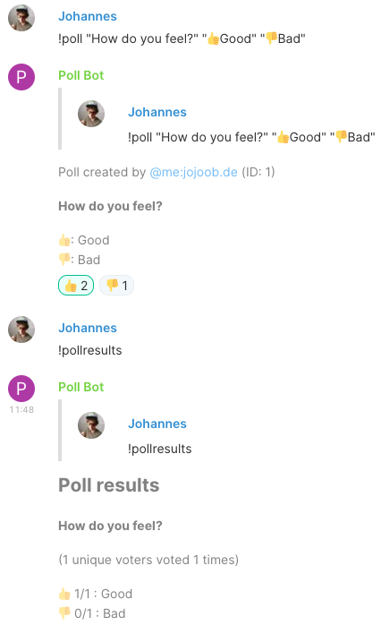

# pollar
A plugin for [maubot](https://github.com/maubot/maubot) that helps with polls in a matrix room. It responds to !poll messages and counts reactions.



## Usage
Request help from the bot:
```
!pollhelp
```

Create a new Poll
```
!poll "Question" "Choice1" "Choice2"

or

!poll Question
Choice1
Choice2
```

To use custom emojis just use an emoji for as the first character of a choice
```
!poll "How are you?" "👍️Good" "👎️Bad"
```

If you want the bot to just reacting to your message instead of responding with a separate message:
```
!lightpoll "How are you?" "👍️Good" "👎️Bad"
```

Display the results of the latest poll in the room
```
!pollresults
```

Display the results of the specified poll in the room
```
!pollresults ID
```

Users vote by reacting with the corresponding emoji.

## Dev
For mac OS:
```bash
fswatch poll.py | xargs -I{} bash -c "zip pollar.mbp maubot.yaml poll.py && curl -XPUT http://localhost:29316/_matrix/maubot/v1/plugin/de.jojoob.matrix.pollbot -H 'Authorization: Bearer TOKEN' --data-binary @pollar.mbp
```
